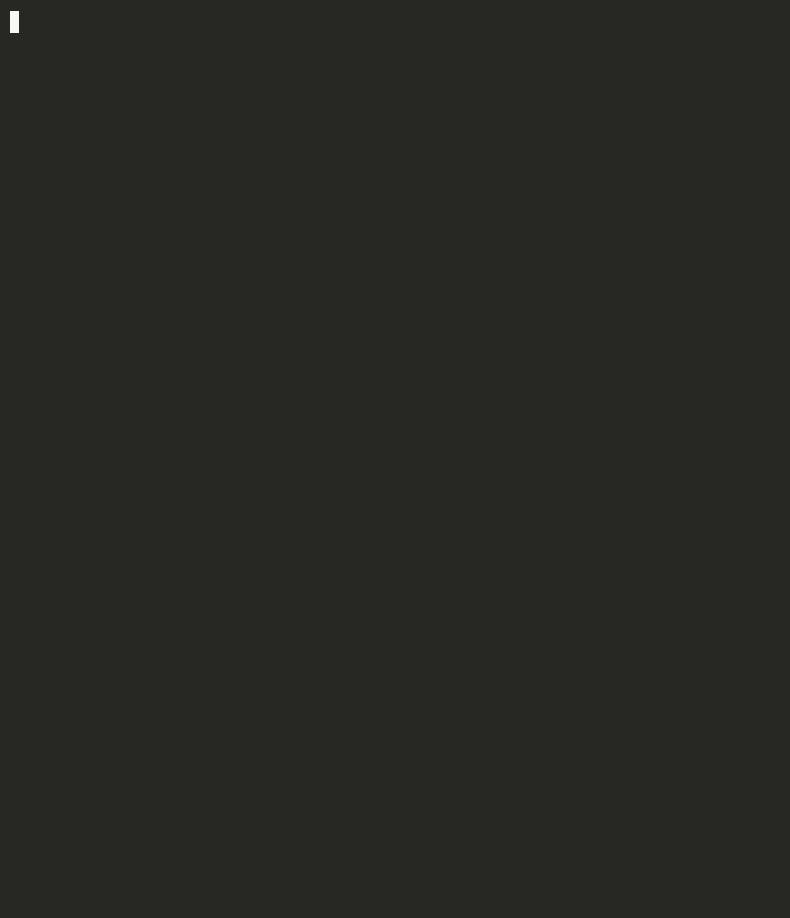

# ci-triage


> From "build failed" to root cause + fix in under a second.

AI-powered CI failure analysis for Jenkins, GitHub Actions, and xcodebuild. Rule-based classification first: fast and free. Claude fallback for ambiguous failures. SQLite-backed flaky test tracker with 90-day recurrence scoring.

Built after watching on-call engineers spend 15–30 minutes manually triage build failures: SSH to Jenkins, scroll thousands of log lines, open a second tab for Jira, post a Slack update. The full context-switch before any actual fix.



## Business impact

Platform engineering teams at 50+ engineer orgs lose an estimated 1.5 hours per engineer per week to diagnosing CI noise. ci-triage reduces that to under 60 seconds per failure: one command that parses the log, identifies the failure site, and exits 1 in pipeline gate mode. At 50 engineers, recovering that time is worth roughly $300K/year in eng capacity at a $200K loaded cost.

---

## What it looks like in practice

```
$ ci-triage analyze xcbuild.log --source xcodebuild --build-id ios27-5512

────────────────────────────────────────────────────────────
  ci-triage
────────────────────────────────────────────────────────────
  ✗  COMPILATION ERROR
  build:  ios27-5512
  source: xcodebuild
  lines:  33
  time:   0ms

  CONFIDENCE
  ██████████████████░░ 90%

  ROOT CAUSE
  Swift/ObjC compilation failed: unresolved symbol or type error

  SUGGESTED FIX
  Check import statements and ensure the symbol is accessible
  in the current module/scope.

  FAILURE SITES
  Sources/MediaDecoder.swift:142:17
    use of unresolved identifier 'AVAssetTrackSegment'
  Sources/MediaDecoder.swift:156:9
    cannot convert value of type 'CMTime' to specified type 'Double'
  Sources/AudioBufferProcessor.swift:89:22
    value of type 'AVAudioFormat' has no member 'channelCapacity'

  (analysis: rule-based)
────────────────────────────────────────────────────────────
```

Same command, same log, but add `--llm` when confidence is below threshold: Claude adds nuanced root cause and platform-specific fix context.

---

## Architecture

> Open `docs/architecture.drawio` in [diagrams.net](https://diagrams.net) for the full interactive diagram.

```
CI Build Fails
      │
      ▼
┌─────────────────────────────────────────────────────────┐
│                      ci-triage                          │
│                                                         │
│  ┌──────────┐   ┌────────────┐   ┌───────────────────┐ │
│  │  Parser  │   │Classifier  │   │ Flaky Tracker     │ │
│  │          │──▶│            │──▶│                   │ │
│  │ Jenkins  │   │ Rule-based │   │ SQLite 90-day     │ │
│  │ GHA      │   │ (21 rules) │   │ recurrence score  │ │
│  │ xcode    │   │            │   │ score > 0.70 →    │ │
│  └──────────┘   │ LLM (opt.) │   │ quarantine flag   │ │
│                 │ Claude API │   └───────────────────┘ │
│                 └────────────┘                         │
│                        │                               │
│          ┌─────────────┼─────────────┐                 │
│          ▼             ▼             ▼                  │
│       Terminal        JSON          Slack               │
│       (ANSI)       (stdout)      (webhook)              │
└─────────────────────────────────────────────────────────┘
```

---

## CI Sources

| Source | Flag | What it parses |
|---|---|---|
| Jenkins | `--source jenkins` | Maven/Gradle `[ERROR]`, `BUILD FAILURE`, exception stack traces, pytest |
| GitHub Actions | `--source github` | `##[error]`, `##[endgroup]`, `::error file=` annotations, pytest/npm errors |
| Xcodebuild | `--source xcodebuild` | `.swift/.m` file:line:col errors, XCTest case failures, linker errors, `** BUILD FAILED **` |

---

## Failure Categories

| Category | Detected by | Example |
|---|---|---|
| `compilation_error` | compiler error patterns, missing symbols | `cannot find symbol`, Swift unresolved identifier, linker error |
| `test_failure` | pytest FAILED, XCTest case failed, AssertionError | `FAILED tests/test_dag.py::test_topological_order` |
| `flaky_test` | retry/intermittent keywords, network-in-test | `connection refused...retry attempt` |
| `resource_exhaustion` | OOM, disk full, cgroup | `java.lang.OutOfMemoryError`, `No space left on device` |
| `infra_failure` | 502/503/504, docker pull, git LFS, k8s | `docker pull manifest unknown`, `git lfs smudge failed` |
| `dependency_failure` | pip/npm/maven resolve failures | `Could not resolve artifact`, `ModuleNotFoundError` |
| `timeout` | build timeout, signal KILL | `Build timed out after 3600 seconds` |

---

## Flaky Test Tracker

Every test failure is recorded in SQLite (`~/.ci-triage/flaky.db`). Recurrence score = failure frequency over the past 90 days. Score above `0.70` → quarantine candidate, flagged inline in the CLI output.

```
$ ci-triage flaky

  Top 5 flaky tests (last 90 days)

  Score  Test
  ─────────────────────────────────────────────────────────
  0.82   ██████████░  tests::test_network_retry  ← quarantine candidate
  0.74   ███████░░░░  tests::test_kafka_consumer_lag  ← quarantine candidate
  0.61   ██████░░░░░  tests::test_s3_presigned_url
  0.33   ███░░░░░░░░  tests::test_artifact_cache_hit
  0.11   █░░░░░░░░░░  tests::test_dag_topological_sort
```

```bash
# JSON output for dashboards/tooling
ci-triage flaky --output json

# Gate CI on flaky-test debt: exit 1 if anything crosses the quarantine threshold
ci-triage flaky --exit-code
```

---

## Python Concepts Demonstrated

Rather than a feature checklist, here is how each concept appears in the actual code:

**Protocol / `@runtime_checkable`**
- `LogParser`: structural Protocol; `JenkinsParser`, `GitHubActionsParser`, `XcodebuildParser` satisfy it without inheriting
- `FailureClassifier`: Protocol; both `RuleBasedClassifier` and `LLMClassifier` satisfy it
- `Reporter`: Protocol used in `cli.py` for `isinstance` check on output format selection

**`@dataclass(slots=True, frozen=True)`**
- `LogEntry`: immutable, `__hash__` automatic, no `__dict__` overhead: safe in sets, 475+ pipeline worth of log entries
- `FailureSite`: frozen record; `context_lines: tuple[str, ...]` instead of list because tuples are hashable
- `_Rule`: internal rule definition; frozen prevents accidental mutation of rule weights at runtime

**`@dataclass(slots=True)` (mutable)**
- `ClassificationResult`: mutable: `failure_sites` populated post-classify by parser
- `TriageReport`: mutable: `flaky_test_scores` filled after SQLite lookup

**Pattern matching (`match`/`case`: Python 3.10+)**
- `cli.py:main()`: dispatches on `args.command` (`"analyze"` / `"flaky"`)
- Replaces an if/elif chain; explicit exhaustiveness via `case _` fallback

**`@contextlib.contextmanager`**
- `FlakyTestTracker._connect()`: context manager wrapping SQLite connection; guarantees `conn.close()` even on exception; used with WAL mode for concurrent write safety

**Generators (implicit, via list comprehensions)**
- `JenkinsParser.extract_failure_sites()`: generator expression over entries for O(n) single-pass extraction
- `TerminalReporter.report()`: sorted + islice for lazy top-N flaky scores

**`__slots__`**
- All `@dataclass(slots=True)` classes: no `__dict__`, fixed memory layout: relevant when processing hundreds of log entries per build

**`ABC` via Protocol**
- `LogParser`, `FailureClassifier`, `Reporter`: Protocols enforce structural contracts without inheritance; checked with `isinstance` at runtime via `@runtime_checkable`

**Regex compilation at module level**
- All `_RE` constants in each parser compiled once at import; not recompiled per `parse()` call: avoids per-invocation overhead across 475 pipeline log reads

---

## Install

```bash
# core (no LLM)
pip install -e .

# with Claude fallback
pip install -e ".[llm]"

# dev (tests + LLM)
pip install -e ".[dev]"
```

### Docker

```bash
docker pull ghcr.io/gerardrecinto/ci-triage:latest
docker run --rm ghcr.io/gerardrecinto/ci-triage:latest analyze build.log --source jenkins
```

---

## Usage

```bash
# Triage a Jenkins log
ci-triage analyze build.log --source jenkins --build-id jenkins-4821

# Read from stdin (pipe from CI system)
cat build.log | ci-triage analyze - --source github

# xcodebuild: Apple CI
ci-triage analyze xcbuild.log --source xcodebuild

# Use Claude when rule confidence < 0.60
ci-triage analyze build.log --source jenkins --llm
export ANTHROPIC_API_KEY=sk-ant-...

# Always use Claude
ci-triage analyze build.log --source jenkins --llm-always

# JSON output (pipe to jq, Jira auto-file, etc.)
ci-triage analyze build.log --source jenkins --output json | jq .classification

# Post to Slack
ci-triage analyze build.log --source jenkins \
  --output slack --slack-webhook https://hooks.slack.com/...

# Show top flaky tests (90-day window)
ci-triage flaky --n 20

# Exit with code 1 on failure: use in CI pipelines to gate merges
ci-triage analyze build.log --source jenkins --exit-code
```

### Pipeline gating with `--exit-code`

`--exit-code` makes ci-triage return exit code 1 when a failure is detected. Drop it into any pipeline step to block merges or deployments on unresolved build failures:

```bash
# GitHub Actions
- run: ci-triage analyze build.log --source github --exit-code

# Jenkins post-build
ci-triage analyze ${BUILD_LOG} --source jenkins --exit-code
```

---

## Environment Variables

| Variable | Purpose |
|---|---|
| `ANTHROPIC_API_KEY` | Required for `--llm` / `--llm-always` |
| `CI_TRIAGE_SLACK_WEBHOOK` | Slack webhook URL (alternative to `--slack-webhook`) |

---

## Tests

```bash
make test        # run all 40 tests
make test-cov    # with coverage report
make demo        # run all three fixtures end-to-end
```

---

## JD Coverage

| Apple JD Requirement | How This Demonstrates It |
|---|---|
| Triage build and test issues affecting CI | Core function: parses Jenkins/GHA/xcodebuild, classifies failure, extracts file:line sites |
| Develop failure analysis systems leveraging AI | `LLMClassifier`: Claude API with prompt caching; rule-first, LLM-fallback architecture |
| Develop tools, scripts, automation workflows | CLI, SQLite tracker, Slack webhook, JSON output for Jira pipeline |
| Python proficiency | Protocol, frozen dataclass, slots, contextmanager, pattern matching, regex, sqlite3, argparse |
| Debugging complex distributed systems | Parsers handle multi-stage CI log formats; tracker surfaces systemic flakiness, not one-off noise |
| Passion for CI UX | Confidence bar, ANSI color by severity, failure sites with file:line:col, fix suggestions |
| Exploring LLM/generative AI for CI | Claude Sonnet 4.6 with ephemeral prompt cache; structured JSON response schema |
| Apple ecosystem | xcodebuild parser handles `.swift`/`.m` compiler errors, XCTest failures, linker errors, `** BUILD FAILED **` |
